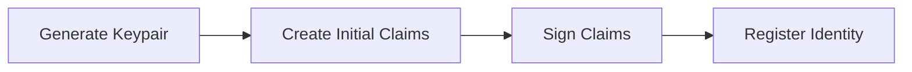
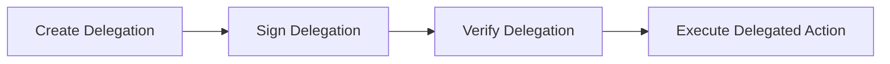

# AgentID Identity Model

## Core Identity Components

### 1. Cryptographic Identity
Each agent identity is built on:
- A secp256k1 keypair (compatible with Ethereum)
- A unique identifier derived from the public key
- Support for key rotation and recovery

### 2. Identity Claims
Claims are structured assertions about an agent's:
- Identity attributes
- Capabilities and permissions
- Validity period
- Trust level

Example claim structure:
```json
{
  "agentId": "0x...",
  "capabilities": ["payment", "trading", "data_access"],
  "validFrom": "2024-03-20T00:00:00Z",
  "validUntil": "2024-04-20T00:00:00Z",
  "trustLevel": "verified",
  "metadata": {
    "agentType": "trading_bot",
    "version": "1.0.0"
  }
}
```

### 3. Delegation Model
The delegation system enables:
- Scoped authority transfer
- Time-limited delegations
- Multi-level delegation chains
- Revocation mechanisms

## Identity Lifecycle

### 1. Creation


### 2. Verification
- On-chain verification via smart contracts
- Off-chain verification using cryptographic proofs
- Cross-platform verification standards

### 3. Delegation


### 4. Revocation
- Immediate revocation capabilities
- Revocation lists and proofs
- Recovery mechanisms

## Trust Framework

### Trust Levels
1. **Unverified**: Basic identity only
2. **Verified**: Identity verified by trusted party
3. **Certified**: Full capability verification
4. **Institutional**: Backed by institutional trust

### Verification Methods
- Self-attestation
- Third-party verification
- On-chain verification
- Cross-chain verification

## Implementation Details

### Key Management
```go
type KeyPair struct {
    PrivateKey []byte
    PublicKey  []byte
    Address    common.Address
}

type Identity struct {
    KeyPair    KeyPair
    Claims     []Claim
    Delegations []Delegation
}
```

### Claim Structure
```go
type Claim struct {
    AgentID     string
    Capabilities []string
    ValidFrom   time.Time
    ValidUntil  time.Time
    TrustLevel  string
    Metadata    map[string]interface{}
    Signature   []byte
}
```

### Delegation Structure
```go
type Delegation struct {
    Delegator   string
    Delegate    string
    Capabilities []string
    ValidFrom   time.Time
    ValidUntil  time.Time
    Signature   []byte
}
```

## Security Considerations

### Key Security
- Secure key generation
- Key storage best practices
- Key rotation policies
- Recovery mechanisms

### Claim Security
- Cryptographic signing
- Claim validation
- Revocation handling
- Trust level verification

### Delegation Security
- Scope limitations
- Time restrictions
- Chain of trust
- Revocation capabilities

## Best Practices

### Identity Creation
1. Use secure random number generation
2. Implement proper key storage
3. Create comprehensive initial claims
4. Register with appropriate trust level

### Identity Management
1. Regular key rotation
2. Claim updates and renewal
3. Delegation monitoring
4. Revocation procedures

### Integration
1. Follow verification standards
2. Implement proper error handling
3. Use appropriate trust levels
4. Monitor delegation chains

## Related Documentation
- [Trust Framework](./trust-framework.md)
- [Security & Privacy](./security-privacy.md)
- [Implementation Guide](./implementation.md)
- [API Reference](./api-reference.md) 