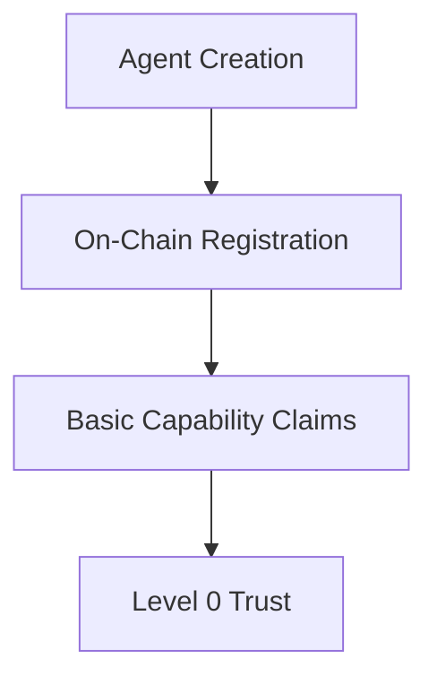
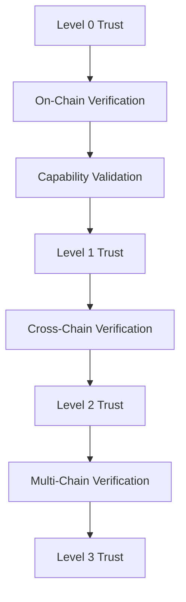

# AgentID Trust Framework

## Overview

The AgentID Trust Framework provides a decentralized system for establishing, verifying, and managing trust in autonomous agent interactions on the blockchain. It combines cryptographic proofs, on-chain verification, and decentralized reputation systems to create a robust trust model.

## Trust Model Components

### 1. Trust Levels

#### Unverified (Level 0)
- Basic on-chain identity only
- No verified capabilities
- Limited to self-attested claims
- Suitable for testing and development

#### Verified (Level 1)
- Identity verified on-chain
- Basic capability verification through smart contracts
- Time-limited validity
- Suitable for most agent interactions

#### Certified (Level 2)
- Full on-chain capability verification
- Regular smart contract audits
- Extended validity periods
- Suitable for critical operations

#### Cross-Chain Verified (Level 3)
- Verified across multiple chains
- Cross-chain capability verification
- Long-term validity
- Suitable for multi-chain operations

### 2. Verification Methods

#### Self-Attestation
```go
type SelfAttestation struct {
    AgentID     string
    Capabilities []string
    Timestamp   time.Time
    Signature   []byte
    ChainID     uint64
}
```

#### On-Chain Verification
```solidity
contract AgentVerifier {
    struct Verification {
        address verifier;
        address agent;
        bytes32[] capabilities;
        uint256 validFrom;
        uint256 validUntil;
        bytes signature;
        uint256 chainId;
    }
    
    mapping(address => Verification[]) public verifications;
    mapping(uint256 => bool) public supportedChains;
    
    function verifyAgent(
        address agent,
        bytes32[] calldata capabilities,
        bytes calldata signature,
        uint256 chainId
    ) external returns (bool) {
        require(supportedChains[chainId], "Unsupported chain");
        // Verification logic
    }
}
```

## Trust Establishment

### 1. Initial Trust


### 2. Trust Enhancement


## Verification Process

### 1. On-Chain Verification
1. Verify cryptographic signature
2. Validate key ownership on-chain
3. Check identity history
4. Assess trust level

### 2. Capability Verification
1. Validate capability claims on-chain
2. Verify delegation chain through smart contracts
3. Check capability scope
4. Assess trust requirements

### 3. Trust Assessment
1. Evaluate on-chain trust level
2. Check verification history
3. Assess cross-chain reputation
4. Validate time constraints

## Implementation

### Trust Verification
```go
type TrustVerifier struct {
    // Trust level requirements
    MinTrustLevel string
    // Required capabilities
    RequiredCapabilities []string
    // Supported chains
    SupportedChains []uint64
    // Smart contract addresses
    VerifierContracts map[uint64]common.Address
}

func (v *TrustVerifier) VerifyTrust(
    agent *Identity,
    requiredLevel string,
    capabilities []string,
    chainId uint64,
) (*TrustAssessment, error) {
    // On-chain trust verification logic
}
```

### Trust Assessment
```go
type TrustAssessment struct {
    AgentID     string
    TrustLevel  string
    Capabilities []string
    ValidFrom   time.Time
    ValidUntil  time.Time
    ChainID     uint64
    Score       float64
    Warnings    []string
}
```

## Trust Maintenance

### 1. On-Chain Audits
- Periodic capability verification
- Trust level reassessment
- Cross-chain reputation updates
- Security checks

### 2. Trust Updates
- Capability modifications on-chain
- Trust level changes
- Verification renewals
- Revocation handling

### 3. Reputation System
- On-chain trust score calculation
- Cross-chain historical performance
- Verification history
- Incident tracking

## Best Practices

### Trust Establishment
1. Start with appropriate trust level
2. Use on-chain verification methods
3. Implement regular audits
4. Maintain verification records

### Trust Management
1. Monitor on-chain trust levels
2. Update capabilities regularly
3. Handle revocations promptly
4. Maintain audit trails

### Integration
1. Define trust requirements
2. Implement on-chain verification
3. Monitor trust changes
4. Handle trust failures

## Security Considerations

### Trust Verification
- Cryptographic validation
- Smart contract verification
- Time-based checks
- Revocation monitoring

### Trust Maintenance
- Regular on-chain audits
- Security updates
- Incident response
- Recovery procedures

## Related Documentation
- [Identity Model](./identity-model.md)
- [Security & Privacy](./security-privacy.md)
- [Implementation Guide](./implementation.md)
- [Use Cases](./use-cases.md)

> Note: For enterprise features including centralized API, PKI integration, and traditional infrastructure support, please see our [Enterprise Version](https://www.agentcommercekit.com/enterprise) or contact us at [hey@ak68a.co](mailto:hey@ak68a.co). 